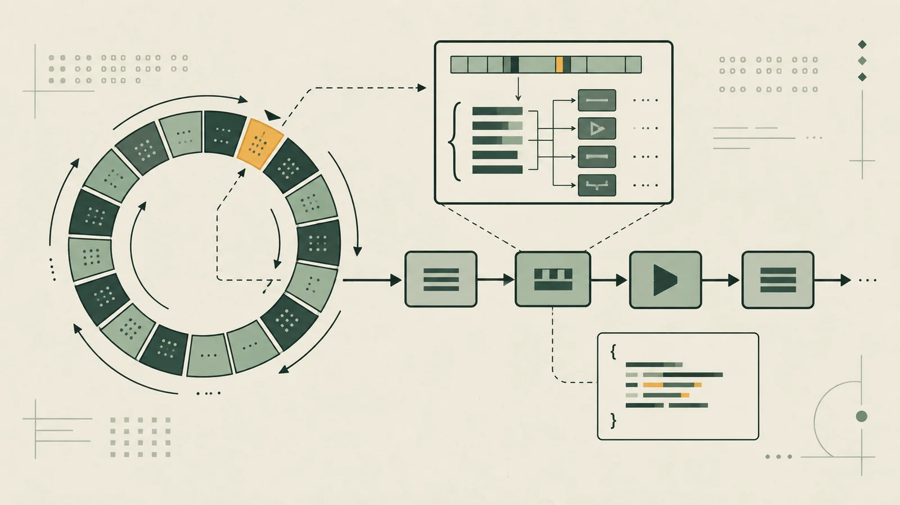

`rv-tracelab` started with a simple question: how much can I learn about C and computer architecture by building a small tool instead of only reading about the concepts?

My tentative answer is a circular buffer that stores execution traces and a decoder for a small RV32I subset. The project is still at the beginning. This post records the design before implementation — including the decisions I will probably have to revisit.

<!--more-->

## The scope

Each trace entry will contain two 32-bit words:

```c {filename="tracebox.h"}
typedef struct {
    uint32_t pc;
    uint32_t instruction;
} TraceEntry;
```

The `pc` identifies where the instruction was; `instruction` keeps the raw word to be decoded later. The first version of the buffer state should look close to this:

```c {filename="tracebox.h"}
typedef struct {
    TraceEntry *entries;
    size_t capacity;
    size_t count;
    size_t head;
} TraceBox;
```

There is not much here, and that is the point. I want to explain the role of every field and keep a few invariants visible:

- `count` never exceeds `capacity`;
- once the buffer is full, a new write replaces the oldest entry;
- reads return entries in chronological order, even after one or several wraps;
- zero capacity, null pointers, and allocation failures are handled errors rather than accidental undefined behavior.

## Why a circular buffer

A tracer does not need to keep an entire execution. When diagnosing what just happened, the latest `N` entries are often more useful than an unbounded history.

A circular buffer forces an important distinction between **physical order** and **logical order**. Elements stop being ordered from index zero onward after the first wrap. The read interface must hide that detail without hiding the reality of the data structure.

It is a small problem that touches allocation, modular arithmetic, bounds, and API design — exactly the kind of exercise I am looking for.

## The minimum decoder

The second part of the project turns instruction words into fields that can be understood and displayed. The first planned subset is:

| Instruction | Format | What I want to practice |
| --- | --- | --- |
| `ADD`, `SUB` | R | `opcode`, `funct3`, `funct7`, and registers |
| `ADDI` | I | sign-extended immediate |
| `LW` | I | base address plus offset |
| `SW` | S | immediate split across two fields |
| `BEQ` | B | reconstructed, aligned branch immediate |

One decision is already made: decoding and formatting will be separate jobs. The word first becomes a structured representation; another function then decides how to display it. This lets me test masks and shifts without depending on a finished string and keeps presentation apart from the decoding rules.

Valid but unsupported instructions also need to survive the entire path. The tool should preserve the original word and report that it cannot interpret it yet, without crashing.

## The route forward

The backlog is split into slices that can be explained and tested independently:

1. define `TraceEntry` and `TraceBox` before adding logic;
2. implement initialization, cleanup, and insertion;
3. prove logical ordering for empty, partial, full, and overwritten buffers;
4. decode one instruction at a time;
5. integrate storage, decoding, and formatting;
6. finish with regression tests, AddressSanitizer, and UndefinedBehaviorSanitizer.

The final demonstration should deliberately exceed buffer capacity and print only the latest entries in their logical order. The `Makefile` will provide at least `make`, `make test`, and `make clean`, compiling with `-Wall`, `-Wextra`, and `-Wpedantic`.

## The criterion that matters

The goal is not an impressive library. It is a `v0.1.0` whose memory, bits, and edge cases I can explain without shortcuts.

The code and progress live in the [rv-tracelab repository](https://github.com/dainlucas/rv-tracelab). As the assumptions in this post meet the implementation, I will return here to record what changed.

